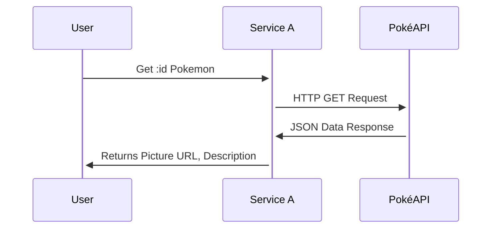

# cs361-microservice-a

Pokedex Info Service

UML Sequence Diagram:


Example request (using localhosted version):
```python
import requests

id = input("Enter the id of the pokemon: ")
resp = requests.get("http://localhost:8000/pokemon/"+id)
print(resp.status_code, resp.json())
```
