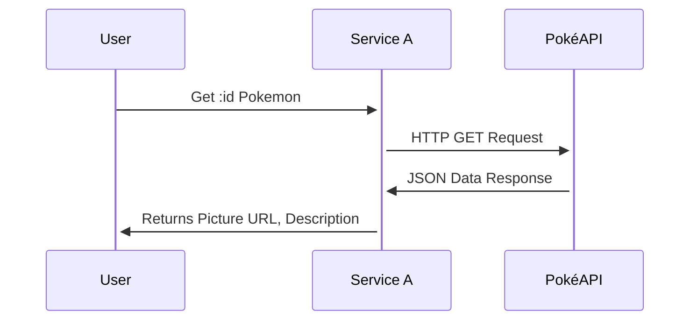

# cs361-microservice-a

Pokedex Info Service

UML Sequence Diagram:

```mermaid
sequenceDiagram
    User->>+Service A: Get :id Pokemon
    Service A->>+PokéAPI: HTTP GET Request
    PokéAPI->>+Service A: JSON Data Response
    Service A->>+User: Returns Picture URL, Description

```
